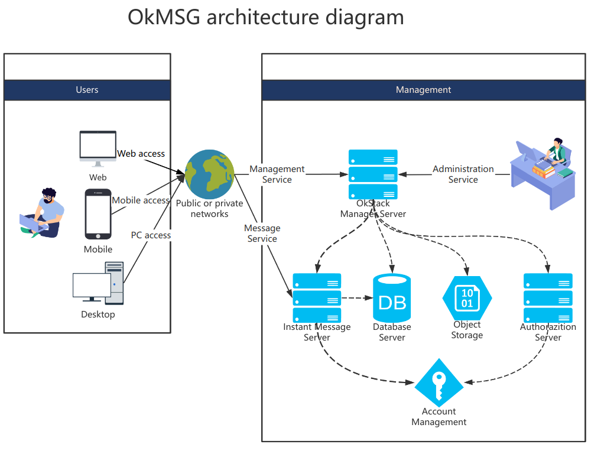
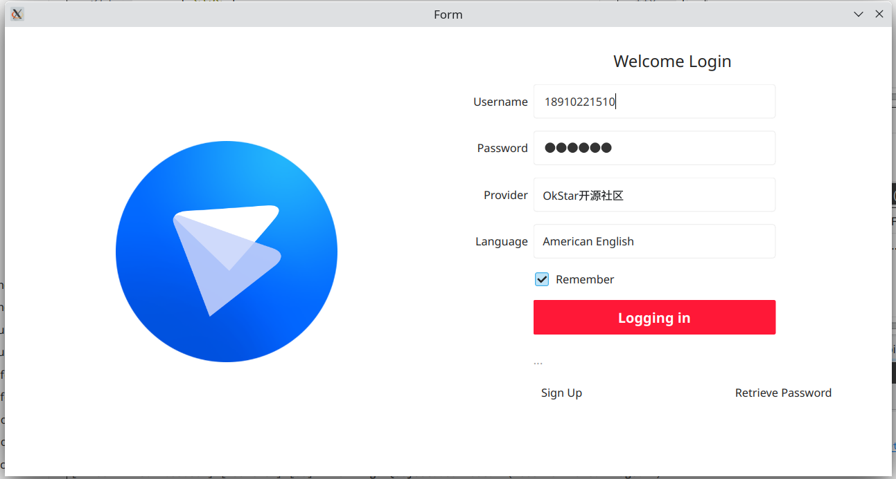

<h1 align="center">OkMSG Desktop</h1>

# 🎁 项目介绍

OkMSG是由OkStar(okstar.org)社区开发和维护的注重数据安全与保护的企业通讯协同工具，支持独立私有化部署的集即时消息、语音、视频通话、发送文件、会议等多种功能于一身的开源项目，同时让您的企业更加有效开启协作、有效沟通，控制成本，开拓新业务，并帮助您加速发展业务。

OkMSG is an enterprise communication collaboration tool developed and maintained by the OkStar (okstar. org) community that focuses on data security and protection. It supports independent private deployment and is an open-source project that integrates multiple functions such as instant messaging, voice, video calling, file sending, and meetings. It enables your enterprise to more effectively initiate collaboration, communicate effectively, control costs, explore new businesses, and help you accelerate business development.

OkMSG的诞生主要解决企业信息化过程中面对的问题：
- 远程协同工具提高工作效率同时,如何保障企业数据安全和隐私、自主可控将成为企业最核心的问题。
- 市面上现有产品同质化严重，市场需要一款有本质化差异的产品。

# 🧭 功能介绍
- 聊天模块
  - 具备单聊、群聊；
  - 支持文字、音视频、文件传输等基本功能；
  - 消息端到端加密。

# 🏢 软件架构

# 🖼️ 界面展示

- Login window

- Main window

# ⛽ Thirty party（第三方库）

- CMake ([New BSD License](https://github.com/Kitware/CMake/blob/master/Copyright.txt))
- WebRTC ([New BSD License](https://github.com/desktop-app/tg_owt/blob/master/LICENSE))
- OpenSSL ([OpenSSL License](https://www.openssl.org/source/license.html))
- OpenAL Soft ([LGPL](https://github.com/kcat/openal-soft/blob/master/COPYING))
- FFmpeg ([LGPL](https://www.ffmpeg.org/legal.html))
- Qt 5.15 ([LGPL](http://doc.qt.io/qt-5/lgpl.html))
- zlib ([zlib License](http://www.zlib.net/zlib_license.html))
- Sqlite3 ([Public Domain](https://sqlite.org/copyright.html))
- libexif([GPL v2](https://github.com/libexif/libexif/blob/master/COPYING))
- libqrencode([GPL v2+](https://github.com/fukuchi/libqrencode))
- qTox([GPL v3](https://github.com/qTox/qTox/LICENSE))
- gloox ([GPL v3](https://gitee.com/chuanshantech/ok-edu-gloox))

# 🖥️ Support platform（支持平台）

| Platform      | Lastest Build Status                                                                                                                                                                                       |
| ------------- | ---------------------------------------------------------------------------------------------------------------------------------------------------------------------------------------------------------- |
| 🪟 Windows-x64 |                     |
| 🐧 Linux-x64   |  |
| 🍎 macOS-x64   |         |
| 🍎 macOS-arm   |         |

# ⚙️ Buildings

本项目目前支持Windows、Linux、macOS环境开发
- C++版本：C++20
- Qt版本：Qt5.15.x

| Platform      | Build Document                                          |
| ------------- | ------------------------------------------------------- |
| 🪟 Windows-x64 | [Build on Windows](docs%2Fbuildings%2Fwindows.md)       |
| 🐧 Ubuntu-x64  | [Build on Ubuntu](docs%2Fbuildings%2Fubuntu.md)         |
| 🐧 Fedora-x64  | [Build on Fedora](docs%2Fbuildings%2Ffedora.md)         |
| 🍎 macOS-x64   | [Build on macOS(x64) ](docs%2Fbuildings%2Fmacos.md)     |
| 🍎 macOS-arm64 | [Build on macOS(arm64) ](docs/buildings/macos-arm64.md) |

# Downloads

- Link: https://github.com/okstar-org/ok-msg-desktop/releases
<table>
    <tr>
        <th></th>
        <th>Windows</th>
        <th>Ubuntu (64-bit)</th>
        <th>Fedora (64-bit)</th>
        <th>Android</th>
        <th>macOS</th>
        <th>iOS</th>
    </tr>
    <tr>
        <th>v24.03.0</th>
        <td>
          <a href="https://github.com/okstar-org/ok-msg-desktop/releases/download/v24.03.0/ok-msg-desktop_windows-latest_x64.zip">Windows 10+</a>
        </td>
        <td>
            <a href="https://github.com/okstar-org/ok-msg-desktop/releases/download/v24.03.0/ok-msg-desktop_ubuntu-22.04_x86_64.deb">Ubuntu 22.04 (deb)</a> 
            <a href="https://snapcraft.io/ok-msg"> </a>
        </td>
        <td>
            <a href="https://github.com/okstar-org/ok-msg-desktop/releases/download/v24.03.0/ok-msg-desktop_fedora-36_x86_64.deb">Fedora</a> 
        </td>
        <td><a href="https://www.pgyer.com/0UruoU">Android</a></td>
        <td>
          规划中 
        </td>
        <td>规划中</td>
    </tr>
</table>

# 🙏 感谢支持
- 感谢社区成员的鼎力支持等
- [感谢 JetBrains 对本项目的支持（Drive by JetBrains）](https://jb.gg/OpenSourceSupport) 

> 欢迎大家 Clone 本项目，捐赠收入将用于对贡献者的奖励。

# 🏭 社区建设

> 为了OkMSG项目能长期有序有质量发展，诚邀有梦想情怀人士加入，一起建设社区，
> 目前规划需要如下方面人才：

- 开发、问题反馈、 Bug修复
- 文档、翻译、设计、品控
- 支持、推广、投资、项目管理

> 社区模式：敬请期待。。。
- 欢迎加入 [OkStar 社区](http://okstar.org)

# 🧑‍🤝‍🧑 贡献者
> 欢迎加入参与社区建设
- [更多](https://github.com/okstar-org/ok-msg-desktop/contributors?ref=master)

# 💰 赞助商

- 湖南船山信息科技有限公司
- Joy1024（个人）
- 社区支持者们

# 📦 欢迎体验
- 下载地址：https://www.chuanshaninfo.com/download/OkMSG/

# ☎️ 联系我们

> 技术交流群，添加微信

> 微信公众号，关注账号

# ©️ 版权信息

> 本软件已经申请软件著作权和商标。
> 本项目采用双重授权，请按合规正确使用本项目！

1.遵循软件分发协议
  - 国际：**[GPL-2.0](https://opensource.org/license/gpl-2-0/)**
  - 中国：**[木兰公共许可证, 第2版](https://opensource.org/license/mulanpsl-2-0/)**

2.付费得到商业授权（试行）
  - [OkMSG软件合作伙伴合同-个人版](https://www.kdocs.cn/l/cgdtyImooeol)
  - [企业版软件授权，请移步👉 chuanshaninfo.com](https://www.chuanshaninfo.com/)
