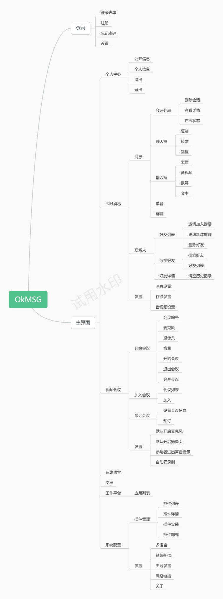
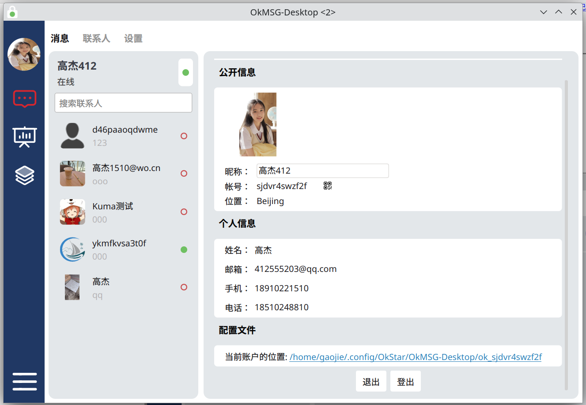
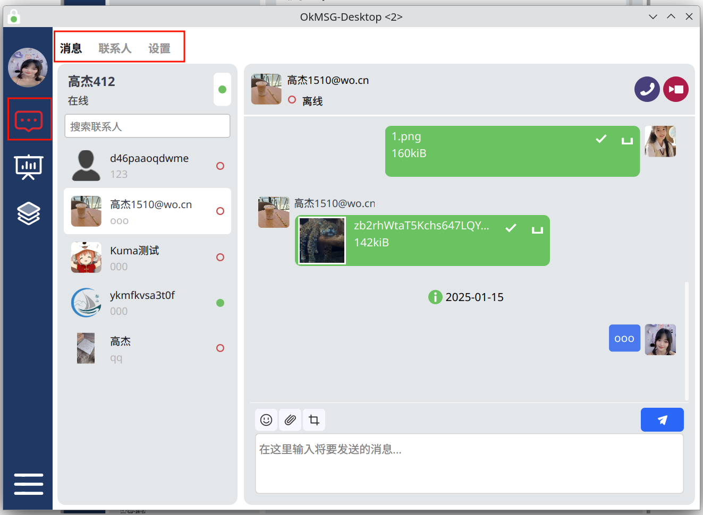
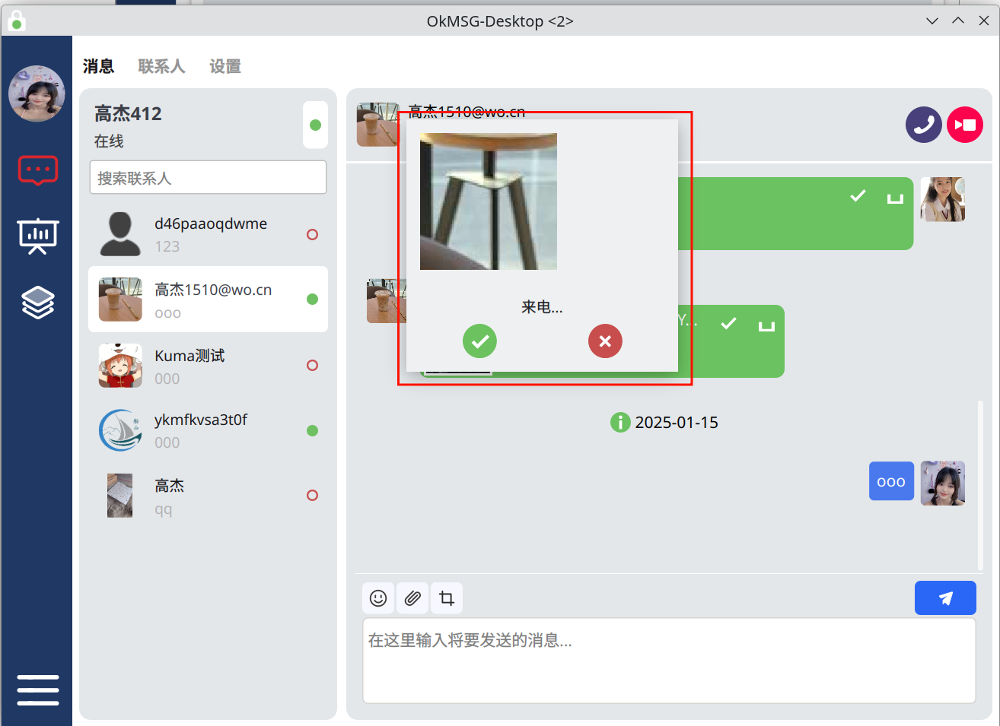
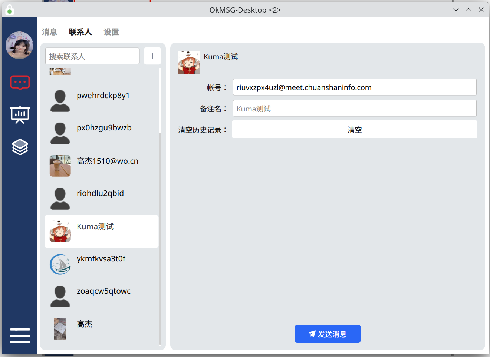
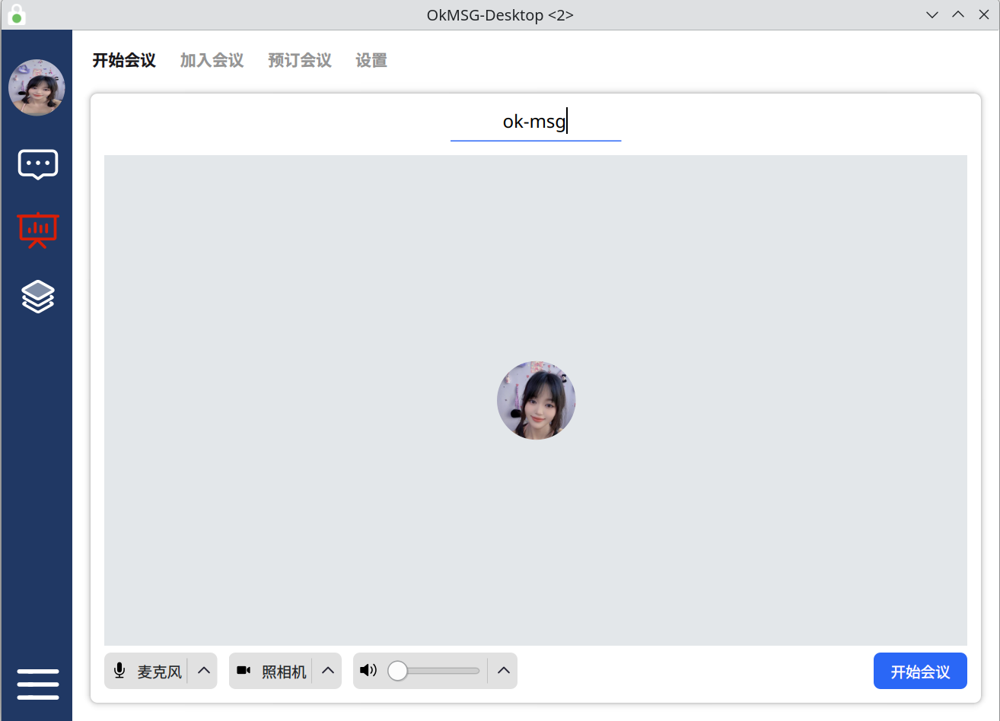
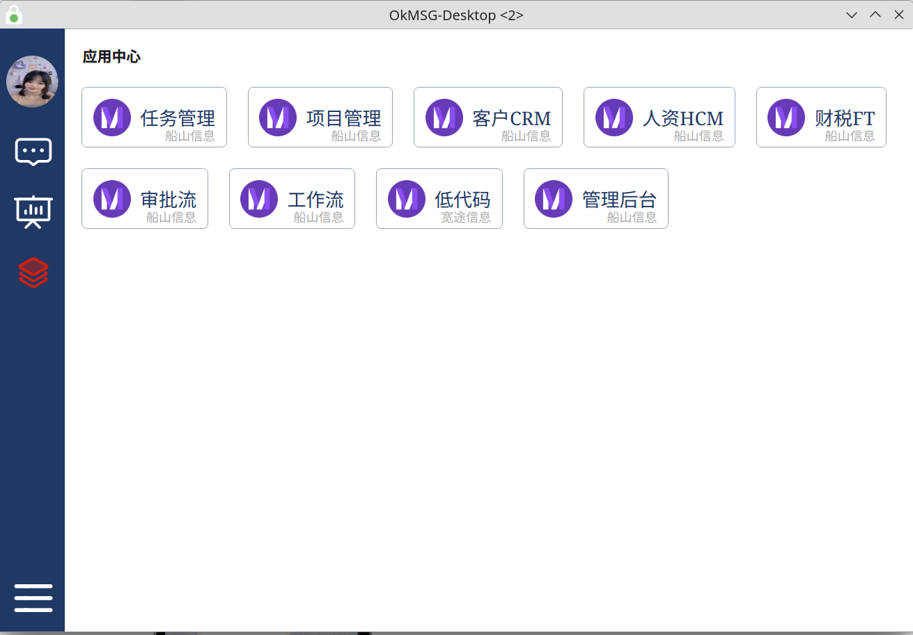
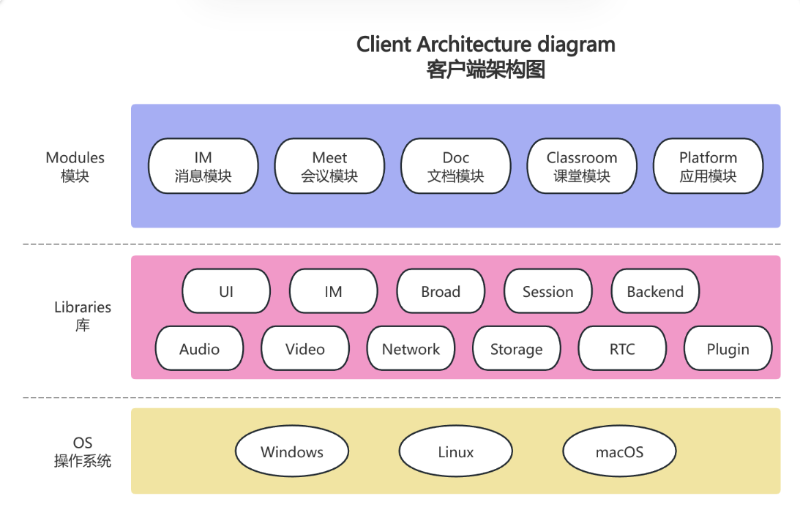

<h1 align="center">OkMSG Desktop</h1>

# 🎁 Introduction（项目介绍）

OkMSG是由OkStar(okstar.org)
社区开发和维护的注重数据安全与保护的企业通讯协同工具，支持独立私有化部署的集即时消息、语音、视频通话、发送文件、会议等多种功能于一身的开源项目，同时让您的企业更加有效开启协作、有效沟通，控制成本，开拓新业务，并帮助您加速发展业务。

OkMSG is an enterprise communication collaboration tool developed and maintained by the OkStar (okstar. org) community
that focuses on data security and protection. It supports independent private deployment and is an open-source project
that integrates multiple functions such as instant messaging, voice, video calling, file sending, and meetings. It
enables your enterprise to more effectively initiate collaboration, communicate effectively, control costs, explore new
businesses, and help you accelerate business development.

OkMSG的诞生主要解决企业信息化过程中面对的问题：

- 远程协同工具提高工作效率同时,如何保障企业数据安全和隐私、自主可控将成为企业最核心的问题。
- 市面上现有产品同质化严重，市场需要一款有本质化差异的产品。

# 🧭 Product Introduction（功能介绍）

- 产品说明书：https://kdocs.cn/l/cgnF1Tof5xIw
- 功能导图：https://kdocs.cn/l/co5VeNMQcDkX

# 🖥️ Support platform（支持平台）

| Meet           | Latest Build Status                                                                                                                                                                                        |
|----------------|------------------------------------------------------------------------------------------------------------------------------------------------------------------------------------------------------------|
| 🪟 Windows-x64 | [](https://github.com/CefView/QCefView/actions/workflows/build-windows-x86_64.yml)                    |
| 🐧 Linux-x64   | [](https://github.com/okstar-org/ok-msg-desktop/actions/workflows/ubuntu.yml/badge.svg) |
| 🍎 macOS-x64   | [](https://github.com/okstar-org/ok-msg-desktop/actions/workflows/mac-x64.yml/badge.svg)        |
| 🍎 macOS-arm   | [](https://github.com/okstar-org/ok-msg-desktop/actions/workflows/mac-arm.yml/badge.svg)        |

# ⚙️ Buildings（构建）

本项目目前支持Windows、Linux、macOS环境开发

- C++版本：C++20
- Qt版本：Qt5.15.x

| Meet           | Build Document                                          |
|----------------|---------------------------------------------------------|
| 🪟 Windows-x64 | [Build on Windows](docs%2Fbuildings%2Fwindows.md)       |
| 🐧 Ubuntu-x64  | [Build on Ubuntu](docs%2Fbuildings%2Fubuntu.md)         |
| 🐧 Fedora-x64  | [Build on Fedora](docs%2Fbuildings%2Ffedora.md)         |
| 🍎 macOS-x64   | [Build on macOS(x64) ](docs%2Fbuildings%2Fmacos.md)     |
| 🍎 macOS-arm64 | [Build on macOS(arm64) ](docs/buildings/macos-arm64.md) |

# 🖼️ Showcase（界面展示）

- Functional Map（功能导图）


- Main window（主界面）


- Profile（个人信息）


- Message（消息）


- Call in（呼入）


- Contact（联系人）


- Start meet（开始会议）


- App. Center（应用中心）



# 🏢 System Architecture Diagram（系统架构图）


# 🏢 Client Architecture Diagram（客户端架构图）



# Downloads（下载）

- Support：Windows(x64), macOS(x64/m1), Ubuntu (x64), Fedora (x64)
- Download: https://github.com/okstar-org/ok-msg-desktop/releases
-

Snap: <a href="https://snapcraft.io/ok-msg"><br></a>

- Flatpak: https://flathub.org/apps/org.okstar.ok-msg


# 🌏 Multi-Language Support（多语言）

| Language         | Progress   | Percent |
|------------------|------------|---------|
| 🇺🇸 English     | Supported  | 100%    |
| 🇨🇳 简体中文        | Supported  | 100%    |
| 🇹🇼 繁体(TW)      | Supported  | 100%    |
| 🇯🇵 Japanese    | #########- | 90%     |
| 🇰🇷 South Korea | ######---- | 60%     |
| 🇩🇪 Germany     | ######---- | 60%     |
| 🇫🇷 France      | ######---- | 60%     |
| 🇵🇹 Portugal    | ######---- | 60%     |
| 🇪🇸 Spain       | ######---- | 60%     |
| 🇮🇹 Italy       | ######---- | 60%     |
| 🇷🇺 Russia      | ######---- | 60%     |

# ⛽ Thirty party（第三方库）

- CMake ([New BSD License](https://github.com/Kitware/CMake/blob/master/Copyright.txt))
- WebRTC ([New BSD License](https://github.com/desktop-app/tg_owt/blob/master/LICENSE))
- OpenSSL ([OpenSSL License](https://www.openssl.org/source/license.html))
- OpenAL Soft ([LGPL](https://github.com/kcat/openal-soft/blob/master/COPYING))
- FFmpeg ([LGPL](https://www.ffmpeg.org/legal.html))
- Qt 5.15 ([LGPL](http://doc.qt.io/qt-5/lgpl.html))
- zlib ([zlib License](http://www.zlib.net/zlib_license.html))
- Sqlite3 ([Public Domain](https://sqlite.org/copyright.html))
- libexif([GPL v2](https://github.com/libexif/libexif/blob/master/COPYING))
- libqrencode([GPL v2+](https://github.com/fukuchi/libqrencode))
- qTox([GPL v3](https://github.com/qTox/qTox/LICENSE))
- gloox ([GPL v3](https://gitee.com/chuanshantech/ok-edu-gloox))

# 🙏 感谢支持

- 感谢社区成员的鼎力支持等
- [感谢 JetBrains 对本项目的支持（Drive by JetBrains）](https://jb.gg/OpenSourceSupport) 

> 欢迎大家 Clone 本项目，捐赠收入将用于对贡献者的奖励。

# 🏭 社区建设

> 为了OkMSG项目能长期有序有质量发展，诚邀有梦想情怀人士加入，一起建设社区，
> 目前规划需要如下方面人才：

- 开发、问题反馈、 Bug修复
- 文档、翻译、设计、品控
- 支持、推广、投资、项目管理

> 社区模式：敬请期待。。。

- 欢迎加入 [OkStar 社区](http://okstar.org)

# 🧑‍🤝‍🧑 贡献者

- [Desktop Contributors](https://github.com/okstar-org/ok-msg-desktop/graphs/contributors)
- [Android Contributors](https://github.com/okstar-org/ok-msg-android/graphs/contributors)
- [iOS Contributors](https://github.com/okstar-org/ok-msg-ios/graphs/contributors)
- [Backend Contributors](https://github.com/okstar-org/ok-stack-backend/graphs/contributors)

# 💰 Support（赞助商）

- [湖南船山信息科技有限公司](https://chuanshaninfo.com)


# ☎️ Discussion（讨论组）

- 技术交流群，添加微信: `gaojiex1314`
- 微信公众号，关注账号: `TheOkStar`
- [Discord](https://discord.gg/nDceKgxnkV)
- [Telegram](https://t.me/okstarorg)

# ©️ Rights（版权信息）

> This software has applied for software copyright and trademark. 本软件已经申请软件著作权和商标。
> This project adopts dual authorization, please use this project in compliance and correctly! 本项目采用双重授权，请按合规正确使用本项目！

## License（授权协议）

- International：**[GPL-2.0](https://opensource.org/license/gpl-2-0/)**
- 中国：**[木兰公共许可证, 第2版](https://opensource.org/license/mulanpsl-2-0/)**

## Payment for commercial license（付费得到商业授权）
### 中国用户
授权类型| 授权功能| 时间 | 价格
-------|-------|------|-------
基本用户授权|二次开发、仅限当前版本、不含新版本和更新、仅限自用不可商业化|终身|1万
高级用户授权|二次开发、未来三个版本以及三年更新、仅限自用不可商业化|终身|3万
旗舰用户授权|二次开发、未来三个版本以及三年更新、可再次商业化|终身|6万
```
购买请添加微信: `hncs-ceo`或`gaojiex1314`
```
### International users 
Please contact me in the following two ways.
- Telegram：`gaojie314` 
- X.com: `TheOkStar`

# Blacklist（黑名单）
公司|姓 名 | 手机号 |微信号| 拉黑时间 |期限  | 拉黑理由
----|-----|-------|-----|--------|------|--------
北京京航数智科技有限公司（91110114MA00D1AG5L）|高*虎|18612**7340|gxh***gxh|2025-02-23|永久| 忽悠、欺骗、白嫖